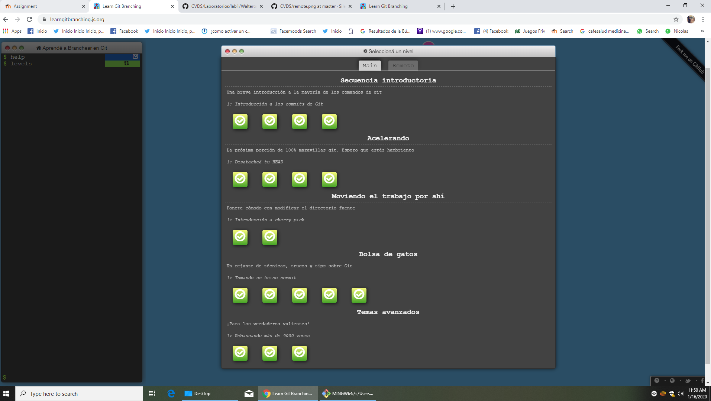
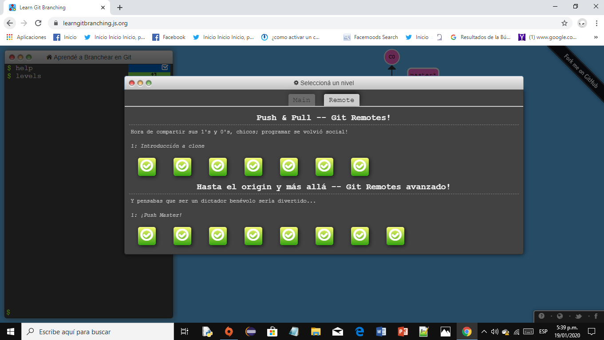

# 1. Nombre
Nicolás Aguilera Contreras
# 2. Datos básicos
### 1. Informacion General
- Fecha de Nacimiento: 06/10/1999
- Pais de nacimiento : Colombia
- Ciudad de Nacimiento: Bogotá
- Institucion Educativa: Escuela Colombiana de Ingenieria Julio Garavito
### 2. Historia academica
Estudié de 2006 a 2010 en el [*Colegio La Salle*](https://colsalle.edu.co/index.php)\
Luego , estudié de 2010 a 2016 en el [*Colegio Antonio Nariño H.H Corazonistas*](http://can.corazonistas.edu.co/)\
Actualmente , estudio actualmente en la [*Escuela Colombiana de Ingenieria Julio Garavito*](https://www.escuelaing.edu.co/es/comunidad/estudiantes)
# 3. Intereses
### Programacion
##### 1. Competencias
Disfruto mucho de la programacion y participo en las competencias que ICPC realiza en mi pais 

##### 2. Lenguaje Favorito
Mi lenguaje favorito para programar es Java.\
Además , no ess dificil y cualquiera lo puede aprender.\
Acá hay un ejemplo de un programa en Java :
```
 public class Basico { 
   public static void main(String args[]) {
	System.out.println("Hola mundo");
    }
}
```
# 4. Git Branching

**Ejercicios main**\
**Nicolás Aguilera Contreras**\
**Carnet : 2156625**



**Ejercicios remote**\
**Nicolás Aguilera Contreras**\
**Carnet : 2156625**



